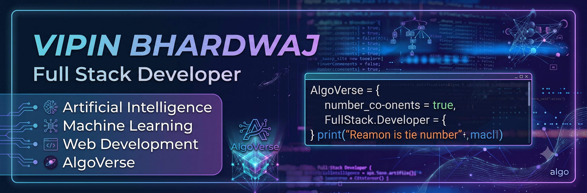

<div align="center">



<br>


<br>


<br><br>

<a href="https://algoverseweb.vercel.app/"></a>
<a href="https://vipinbhardwaj-07.github.io/VipinBhardwaj-portfolio/"></a>
<a href="https://www.linkedin.com/in/vipin-bhardwaj-55a5a93a9"></a>
<a href="mailto:vipinbhardwaj0827@gmail.com"></a>

</div>

<br>


## 🧑‍💻 About Me


I'm **Vipin Bhardwaj**, a **Full Stack Developer** pursuing my **B.Tech in Computer Science**, based in India. I love turning ideas into real, working products — and right now that means building **AlgoVerse**, an interactive platform that makes learning Data Structures & Algorithms visual and engaging.

```yaml
🔭 Currently Building:  AlgoVerse — Interactive DSA Learning Platform
🌱 Currently Learning:  Next.js · System Design · Docker · Cloud
🤖 Also Exploring:      AI / Machine Learning · Backend APIs
💬 Ask Me About:        React, Node.js, DSA, Web Development
📫 Reach Me:            vipinbhardwaj0827@gmail.com
⚡ Fun Fact:            Coffee makes debugging 10x easier ☕
```

> 💭 **"First, solve the problem. Then, write the code."** — John Johnson

<br clear="right"/>

---

## 🛠️ Tech Stack

<div align="center">

**Languages**
<br>


**Frontend**
<br>


**Backend & Databases**
<br>


**AI / ML**
<br>


**Tools & DevOps**
<br>


</div>

---

## 🚀 Featured Projects

<div align="center">

<a href="https://algoverseweb.vercel.app" target="_blank">

</a>
<a href="https://github.com/VipinBhardwaj-07/CNN-Image-Classification" target="_blank">

</a>

<a href="https://vipinbhardwaj-07.github.io/VipinBhardwaj-portfolio/" target="_blank">

</a>

</div>

<details>
<summary><b>📖 Project Details — click to expand</b></summary>
<br>

**🌐 AlgoVerse** — An interactive DSA learning platform with a beginner-friendly, visual approach to algorithms. Built with HTML, CSS & JavaScript, with an AI-powered learning vision on the roadmap.
[Live Demo →](https://algoverseweb.vercel.app) 

**🤖 CNN Image Classification** — A deep learning model (Cats vs Dogs classifier) built with TensorFlow, Keras & OpenCV, covering image preprocessing through model training and evaluation.

**💼 Personal Portfolio** — A modern, responsive developer portfolio with a dark theme, project showcase, and certificates section.
[Live Site →](https://vipinbhardwaj-07.github.io/VipinBhardwaj-portfolio/)

**📚 DSA Repository** — Solutions spanning Arrays, Strings, Linked Lists, Trees, Graphs, Dynamic Programming, Greedy Algorithms & Backtracking, in C++ and Java.

</details>

---

## 📊 GitHub Analytics

<div align="center">


</div>

<details>
<summary><b>🏆 GitHub Trophies — click to expand</b></summary>
<br>
<div align="center">

</div>
</details>

---

## 🐍 Contribution Snake

<div align="center">

</div>

---

## 🎯 2026 Goals

<table align="center">
<tr>
<td width="50%" valign="top">

**🔥 Building**
- 🌐 AlgoVerse platform
- 💻 Production-ready full-stack apps
- ☁️ Scalable backend APIs
- 🤖 AI-powered SaaS products

</td>
<td width="50%" valign="top">

**📈 Growing**
- ⚛️ Master React & Next.js
- 🧠 Learn System Design
- 🐳 Docker & Cloud Computing
- 🏆 Land a top tech internship

</td>
</tr>
</table>

---

## 🤝 Let's Connect

<div align="center">

I'm open to **full-stack projects, open-source collaboration, hackathons, and internship opportunities.** Feel free to reach out!

<a href="https://github.com/VipinBhardwaj-07"></a>
<a href="https://www.linkedin.com/in/vipin-bhardwaj-55a5a93a9"></a>
<a href="mailto:vipinbhardwaj0827@gmail.com"></a>

<br><br>

⭐ **Consistency beats intensity — small daily improvements create extraordinary results.** ⭐


</div>
