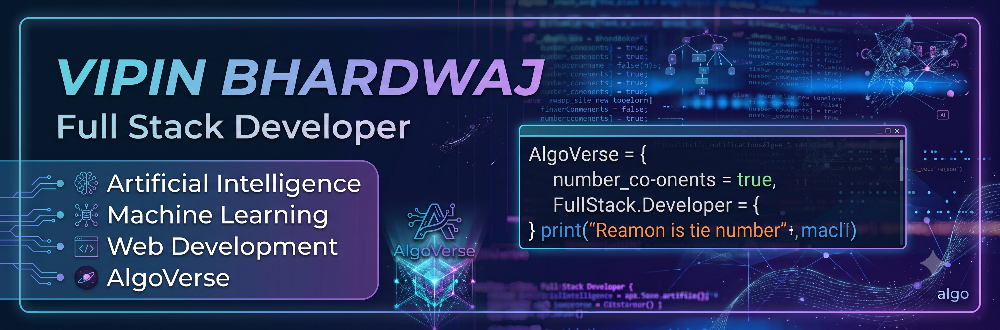

 

# 👋 Hi, I'm **Vipin Bhardwaj**

### 🚀 Full Stack Developer • 🤖 AI Enthusiast • 🧠 Machine Learning Explorer • 📚 DSA Learner

 

  

---

# 👨‍💻 About Me

### 👋 Hi, I'm **Vipin Bhardwaj**

**B.Tech Computer Science Student • AI Software Engineer Aspirant**

I'm passionate about **building web applications, exploring AI & Machine Learning, and solving problems with Data Structures & Algorithms.**

* 🚀 Currently building **[AlgoVerse](https://algoverseweb.onrender.com)** — an interactive DSA learning platform
* 🤖 Exploring **Artificial Intelligence & Machine Learning**
* 💻 Building projects with **Web Development & Backend Technologies**
* 📚 Strengthening my **DSA & Problem-Solving** skills
* 🌱 Currently learning **React.js, Node.js, MongoDB & System Design**

> 💡 **Learn → Build → Improve → Repeat**

---

# 🚀 Current Focus

| 🔥 Building                | 🌱 Learning           |
| -------------------------- | --------------------- |
| 🌐 AlgoVerse               | ⚛️ React.js           |
| 🤖 AI Projects             | 🟢 Node.js            |
| 💻 Full Stack Applications | 🍃 MongoDB            |
| 📚 DSA Projects            | 🧠 System Design      |
| ⚙️ Backend APIs            | ☁️ Cloud & Deployment |

---

# 🛠️ Tech Stack

## 💻 Programming Languages

## 🌐 Web Development

## 🤖 AI & Machine Learning

## 🗄️ Database & Tools

---

# 🌟 Featured Projects

## 🚀 AlgoVerse

> **Interactive Data Structures & Algorithms Learning Platform**

AlgoVerse is a platform focused on making **Data Structures & Algorithms easier to understand through visual learning, interactive content, and AI-powered features.**

### ✨ Highlights

* 📚 DSA learning resources
* 📊 Interactive algorithm visualizations
* 🤖 AI-powered learning features
* 🔐 User authentication
* 📱 Responsive design
* ⚙️ Node.js backend
* 🗄️ MongoDB database

### 🛠️ Tech

### 🔗 Links

 

---

## 🤖 CNN Image Classification

> **Cats vs Dogs Image Classification using Deep Learning**

A deep learning project that uses a **Convolutional Neural Network** to classify images of cats and dogs.

### ✨ Highlights

* 🧠 Convolutional Neural Network
* 🐱 Cats vs Dogs Classification
* 📊 Model Training
* 🎯 Image Prediction
* 🖼️ Image Processing

### 🛠️ Tech

### 🔗 Source Code

 

---

## 🌐 Personal Portfolio

> **My personal developer portfolio**

A modern portfolio showcasing my **projects, skills, certifications, and development journey**.

### ✨ Highlights

* 🎨 Modern UI
* 🌙 Dark Theme
* 📱 Responsive Design
* 🚀 Project Showcase
* 📜 Certifications
* 💻 Developer-focused design

### 🛠️ Tech

### 🔗 Links

 

---

# 📚 Currently Learning

  

**React.js • Node.js • MongoDB • Docker • AI/ML • System Design • Cloud Computing**

---

# 🏆 Certifications

| 🎓 Certification   | 🏢 Platform |
| ------------------ | ----------- |
| 🐍 Python          | GUVI        |
| ☁️ Cloud Computing | Infosys     |
| 🤖 YUVA AI         | TCS iON     |
| 🤖 PBEL            | NASSCOM     |
| 🧠 Generative AI   | SJF         |
| 📚 DSA             | Skill Up    |

---

# 📊 GitHub Analytics

 

 

---

# 🐍 Contribution Snake

---

# 🎯 My Goals

* 🚀 Build production-ready applications
* 🤖 Create practical AI/ML projects
* 📚 Become stronger at DSA and problem-solving
* 🌐 Contribute to open source
* 💼 Gain software engineering experience
* 🧠 Become a strong **AI Software Engineer**

---

# 🤝 Let's Connect

---

### 💜 Thanks for visiting my profile!

**Keep Learning • Keep Building • Keep Growing 🚀**

 

